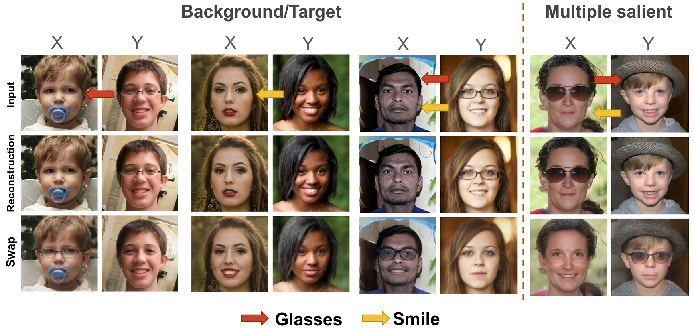

This repository contains the official PyTorch implementation for CS-StyleGAN and CS-DiffusionAE, as described in our paper:
### Learning Common and Salient Generative Factors Between Two Image Datasets

## Overview

<p align="center">
  
  <br>
  Our framework learns <i>common</i> and <i>salient</i> factors for <b><span style="color:#3467eb;">Contrastive Analysis (CA)</span></b> on high-quality images.
  It handles not only the most studied <b>Background/Target</b> assumption of CA, where one dataset (target, e.g., <b>X</b>) contains some modified/added patterns with respect to the second one (background, e.g., <b>Y</b>), but also the more challenging <b>Multiple-Salient</b> problem, where both datasets are assumed to have their own distinctive patterns (for example, glasses in <b>X</b> and a smile in <b>Y</b>).
</p>

# CS-StyleGAN

## Requirements

Install all dependencies with:

```bash
pip install -r requirements.txt
```

## Dataset Setup

Before training, set the dataset paths in `./configs/paths_config.py`.
You need four folders:

* Background (X) images for training
* Target (Y) images for training
* Background (X) images for testing
* Target (Y) images for testing

Supported input: **.png** images

**Example (`paths_config.py`):**

```python
dataset_paths = {
    'ffhq_bg_train': 'path/to/your/background/train/images',
    'ffhq_glass_train': 'path/to/your/target/train/images',
    'ffhq_bg_test': 'path/to/your/background/test/images',
    'ffhq_glass_test': 'path/to/your/target/test/images',
}
```

*Here, `ffhq_bg` and `ffhq_glass` could refer to FFHQ images without and with glasses, respectively.*

---

## Pretrained Models

Download the pretrained models:

| Path                                                                                                              | Description                                                                                                 |
| ----------------------------------------------------------------------------------------------------------------- | ----------------------------------------------------------------------------------------------------------- |
| [Pretrained pSp](https://drive.google.com/file/d/1bMTNWkh5LArlaWSc_wa8VKyq2V42T2z0/view?usp=sharing)              | pSp model trained on FFHQ                                                                                   |
| [Pretrained StyleGAN2](https://drive.google.com/file/d/1EM87UquaoQmk17Q8d5kYIAHqu0dkYqdT/view?usp=sharing)        | StyleGAN2 pretrained on FFHQ ([rosinality implementation](https://github.com/rosinality/stylegan2-pytorch)) |
| [Pretrained pSp\_on\_BraTS](https://drive.google.com/file/d/1nqXMxZV4B_W5GTRE-pk6iTc3wkswgNd_/view?usp=sharing)   | pSp trained on BraTS2023                                                                                    |
| [Pretrained StyleGAN2\_BraTS](https://drive.google.com/file/d/1KjEzuKW4-t62EuyRhJIOVChXh8q1WoaV/view?usp=sharing) | StyleGAN2 pretrained on BraTS2023                                                                           |

---

## Training stage 1:

Example command:

```bash
python training_scripts/train.py \
    --dataset_type=ffhq_glasses \
    --stylegan_weights=./psp_ffhq_encode.pt \
    --pSp_checkpoint_path=./stylegan2-ffhq1024.pt \
    --exp_dir=results/baseline/
```

---

## Training stage 2:

Example command:

```bash
cd ./F_space refinement \
python scripts/train.py \
    exp.exp_dir=./experiments/ \
    data.dataset=ffhq_glasses \
    exp.config_dir=configs \
    exp.config=fse_cs_editor_train.yaml \
    exp.name=fse_cs_editor_train/pSp_encoder/ablation/ffhq_glasses_cs1s2 \
    methods_args.fse_full.inverter_pth=./pretrained_models/sfe_inverter_light.pt \
    train.train_runner=fse_editor_cs1s2 \
    train.start_step=300000 \
    train.direction=two_directions \
    train.log_step=2000 \
    train.val_step=2000 \
    train.checkpoint_step=10000 \
    data.special_idx=0 \
    model.w_space_encoder=pSp \
    model.stylegan_size=1024 \
```

---

# CS-DiffusionAE

The code for training the **CS-DiffusionAE** model can be found in `./CS-DiffusionAE/`.

## Dataset

For faster training, it is recommended to preprocess the image data into **LMDB** format using:

```bash
python ./CS-DiffusionAE/train_cs/preprocess_lmdb.py
```

Otherwise, you can also use datasets in other formats (e.g., .png image folders) by modifying the dataset input part in `./CS-DiffusionAE/train_cs/train_common_salient_baseline.py`.

## Training
First, download the pretrained models from [diffae](https://github.com/phizaz/diffae).
Example command for training **without image losses** (faster training but suboptimal results):

```bash
cd ./F_space refinement \
# train with only latent loss (baseline)
python train_cs/train_common_salient_baseline.py \
    --results_dir=./results/layers2/lr=0.0001 \
    --n_layers=2 \
    --learning_rate=0.0001 \
    --w_bg=10.0 \
    --w_t=10.0 \
    --w_sbg=10.0 \
```

Alternatively, modify `train_common_salient_full.py` to train the CS model **with image losses**.  
In this case, you may need fewer training steps (around **4000**) to achieve good performance.

# CS-Asyrp

_Update coming soon..._

# Acknowledgments
This code borrows heavily from [pixel2style2pixel](https://github.com/eladrich/pixel2style2pixel), [StyleFeatureEditor](https://github.com/ControlGenAI/StyleFeatureEditor), and [diffae](https://github.com/phizaz/diffae)

---

# Contact

For more implementation details and results, please see the main paper and Supplementary Material, or contact us via 

_Update coming soon..._

---
