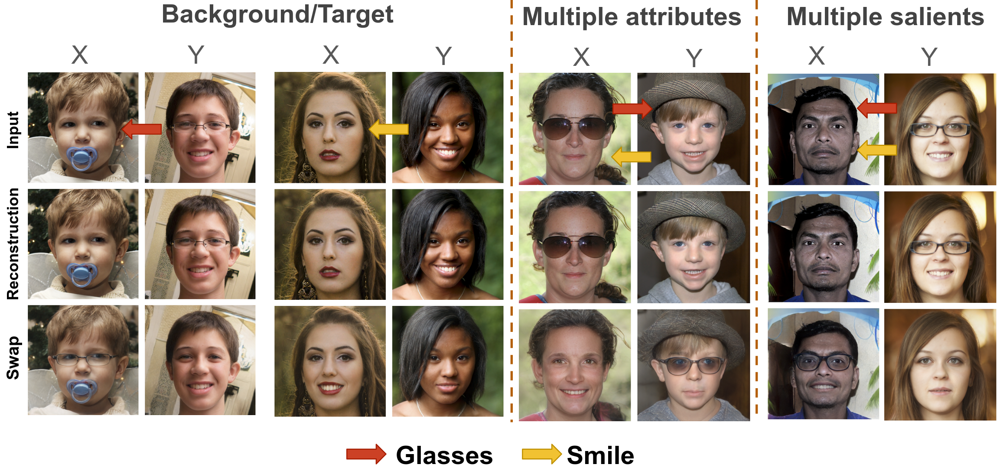
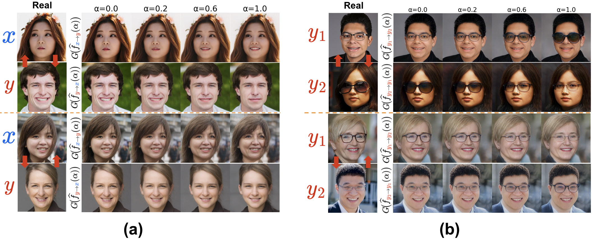
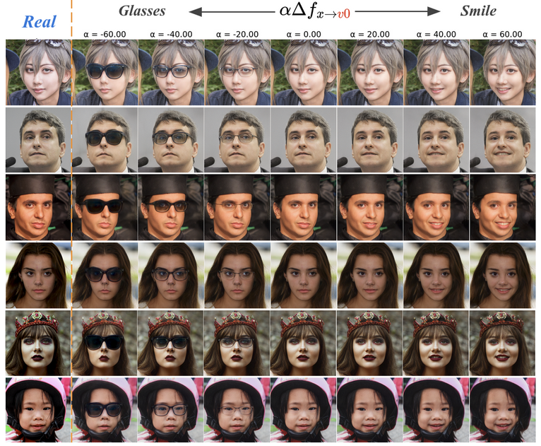
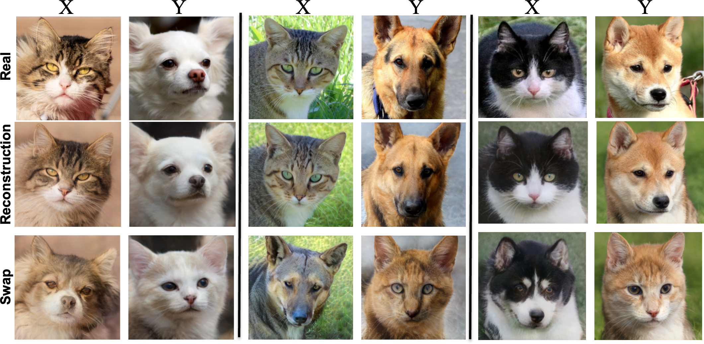
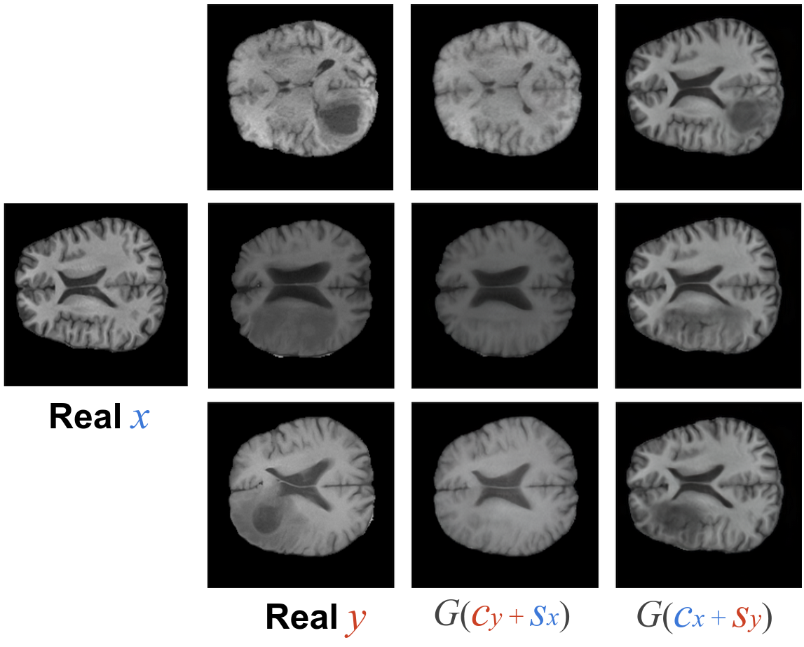

# Official PyTorch implementation of **CS-StyleGAN and CS-Diffusion**, from the paper:<br>
## **“Learning Common and Salient Generative Factors Between Two Image Datasets”**

## Abstract

<p align="justify">
Recent advancements in image synthesis have enabled high-quality image generation and manipulation. Most works focus on: 1) <b>conditional manipulation</b>, where an image is modified conditioned on a given attribute, or 2) <b>disentangled representation learning</b>, where each latent direction should represent a distinct semantic attribute. This work focuses on a different and less studied research problem, called <b>Contrastive Analysis (CA)</b>. Given two image datasets, we want to separate the <b>common</b> generative factors, shared across the two datasets, from the <b>salient</b> ones, specific to only one dataset. Compared to existing methods, which use attributes as supervised signals for editing (e.g., glasses, gender), the proposed method is weaker, since it only uses the dataset signal. We propose a novel framework for CA that can be adapted to both <b>GAN</b> and <b>Diffusion</b> models to learn both common and salient factors. By defining new and well-adapted learning strategies and losses, we ensure a relevant separation between common and salient factors while preserving high-quality generation. We evaluate our approach on diverse datasets, covering human faces, animal images, and medical scans, and demonstrate superior separation ability and image quality compared to prior methods.
</p>

## Qualitative Examples


### ***Contrastive Analysis***

<p align="center">
  
  <br>
  <span style="display:inline-block; max-width:800px; text-align:justify;">
    Our framework learns <i>common</i> and <i>salient</i> factors for 
    <b>Contrastive Analysis (CA)</b> on high-quality images.
    It handles the typical <b>Background / Target</b> problem (X/Y), where only the target dataset (Y) contains a single salient attribute (e.g., glasses) absent from the background (X); the <b>Multiple-Attributes</b> setting, where the target dataset (Y) contains multiple salient attributes (e.g., glasses and smile); and the more challenging <b>Multiple-Salient</b> setting, where each of the datasets (X and Y) has its own distinct salient attribute (e.g., glasses in X, smile in Y).
  </span>
</p>

### Latent Interpolations
<p align="center">
  
  <br>
  <span style="display:inline-block; max-width:800px; text-align:justify;">
    Interpolations along the salient factors (S) for <b>(a)</b> a background sample x and a target sample y, and <b>(b)</b> two target samples y₁ and y₂.
  </span>
</p>
<p align="center">
  
  <br>
  <span style="display:inline-block; max-width:800px; text-align:justify;">
    Interpolations along the 1st PCA direction computed from the salients of Y dataset (contains both glasses and smiles).
  </span>
</p>

### Animal images: Cat (X) vs. Dog (Y)

<p align="center">
  
  <br>
  <span style="display:inline-block; max-width:600px; text-align:justify;">
    Contrastive analysis on the AFHQv2 dataset, where X contains cat images and Y contains dog images.
  </span>
</p>

### Medical Imaging (brain MRI scans)

<p align="center">
  
  <br>
  <span style="display:inline-block; max-width:600px; text-align:justify;">
    Salient-factor swapping on MRI scans: X corresponds to healthy brains and Y to brains with tumors, illustrating how pathological patterns can be transferred while preserving anatomical structure.
  </span>
</p>


## Methods

### CS-StyleGAN (latent space of StyleGAN2)

- Applies the proposed CA framework in the latent space of StyleGAN2 (both **W+** and **F-space**).
- Evaluated on **FFHQ**, **AFHQv2**, and **BraTS** with X/Y (background/target) splits.
- Supports **Background/Target**, **Multiple-Attributes**, and **Multiple-Salient** settings.

### CS-DiffusionAE (Diffusion autoencoder)

- Extends the CA framework to diffusion models by building on **DiffAE**  
  (see the original [DiffAE GitHub repository](https://github.com/phizaz/diffae) for backbone details).

### CS-Asyrp (h-space of U-Net)

- Applies the proposed CA framework in the **h-space** of a U-Net using an **Asyrp-based** DDIM reverse process  
  (see the original [Asyrp GitHub repository](https://github.com/kwonminki/Asyrp_official) for backbone details).


## Quick start

```bash
pip install -r requirements.txt

### Dataset Setup

Before training, set the dataset paths in `./configs/paths_config.py`.
You need four folders:

* Background (X) images for training
* Target (Y) images for training
* Background (X) images for testing
* Target (Y) images for testing

Supported input: **.png** images

**Example (`paths_config.py`):**

```python
dataset_paths = {
    'ffhq_bg_train': 'path/to/your/background/train/images',
    'ffhq_glass_train': 'path/to/your/target/train/images',
    'ffhq_bg_test': 'path/to/your/background/test/images',
    'ffhq_glass_test': 'path/to/your/target/test/images',
}
```

*Here, `ffhq_bg` and `ffhq_glass` could refer to FFHQ images without and with glasses, respectively.*

---

### Pretrained Models

Download the pretrained models:

| Path                                                                                                              | Description                                                                                                 |
| ----------------------------------------------------------------------------------------------------------------- | ----------------------------------------------------------------------------------------------------------- |
| [Pretrained pSp](https://drive.google.com/file/d/1bMTNWkh5LArlaWSc_wa8VKyq2V42T2z0/view?usp=sharing)              | pSp model trained on FFHQ                                                                                   |
| [Pretrained StyleGAN2](https://drive.google.com/file/d/1EM87UquaoQmk17Q8d5kYIAHqu0dkYqdT/view?usp=sharing)        | StyleGAN2 pretrained on FFHQ ([rosinality implementation](https://github.com/rosinality/stylegan2-pytorch)) |
| [Pretrained pSp\_on\_BraTS](https://drive.google.com/file/d/1nqXMxZV4B_W5GTRE-pk6iTc3wkswgNd_/view?usp=sharing)   | pSp trained on BraTS2023                                                                                    |
| [Pretrained StyleGAN2\_BraTS](https://drive.google.com/file/d/1KjEzuKW4-t62EuyRhJIOVChXh8q1WoaV/view?usp=sharing) | StyleGAN2 pretrained on BraTS2023                                                                           |

---

### Training stage 1:

Example command:

```bash
python training_scripts/train.py \
    --dataset_type=ffhq_glasses \
    --stylegan_weights=./psp_ffhq_encode.pt \
    --pSp_checkpoint_path=./stylegan2-ffhq1024.pt \
    --exp_dir=results/baseline/
```

---

### Training stage 2:

Example command:

```bash
cd ./F_space refinement \
python scripts/train.py \
    exp.exp_dir=./experiments/ \
    data.dataset=ffhq_glasses \
    exp.config_dir=configs \
    exp.config=fse_cs_editor_train.yaml \
    exp.name=fse_cs_editor_train/pSp_encoder/ablation/ffhq_glasses_cs1s2 \
    methods_args.fse_full.inverter_pth=./pretrained_models/sfe_inverter_light.pt \
    train.train_runner=fse_editor_cs1s2 \
    train.start_step=300000 \
    train.direction=two_directions \
    train.log_step=2000 \
    train.val_step=2000 \
    train.checkpoint_step=10000 \
    data.special_idx=0 \
    model.w_space_encoder=pSp \
    model.stylegan_size=1024 \
```

---

## CS-DiffusionAE

The code for training the **CS-DiffusionAE** model can be found in `./CS-DiffusionAE/`.

### Dataset

For faster training, it is recommended to preprocess the image data into **LMDB** format using:

```bash
python ./CS-DiffusionAE/train_cs/preprocess_lmdb.py
```

Otherwise, you can also use datasets in other formats (e.g., .png image folders) by modifying the dataset input part in `./CS-DiffusionAE/train_cs/train_common_salient_baseline.py`.

### Training
First, download the pretrained models from [diffae](https://github.com/phizaz/diffae).

Example command for training **without image losses** (faster training but suboptimal results):

```bash
cd ./F_space refinement \
# train with only latent loss (baseline)
python train_cs/train_common_salient_baseline.py \
    --results_dir=./results/layers2/lr=0.0001 \
    --n_layers=2 \
    --learning_rate=0.0001 \
    --w_bg=10.0 \
    --w_t=10.0 \
    --w_sbg=10.0 \
```

Alternatively, modify `train_common_salient_full.py` to train the CS model **with image losses**.  
In this case, you may need fewer training steps (around **4000**) to achieve good performance.

## CS-Asyrp (h-space of U-Net)

For full details and code, please refer to the dedicated repository: https://github.com/ZiqianLiu666/Asyrp-h_space 

## Acknowledgments
This code borrows heavily from [pixel2style2pixel](https://github.com/eladrich/pixel2style2pixel), [StyleFeatureEditor](https://github.com/ControlGenAI/StyleFeatureEditor), [Asyrp](https://github.com/kwonminki/Asyrp_official), and [diffae](https://github.com/phizaz/diffae)

---

## Contact
If you have any questions about the code, implementation details, or pretrained models, please feel free to contact me at **ylh.icandoit@gmail.com**.


---
